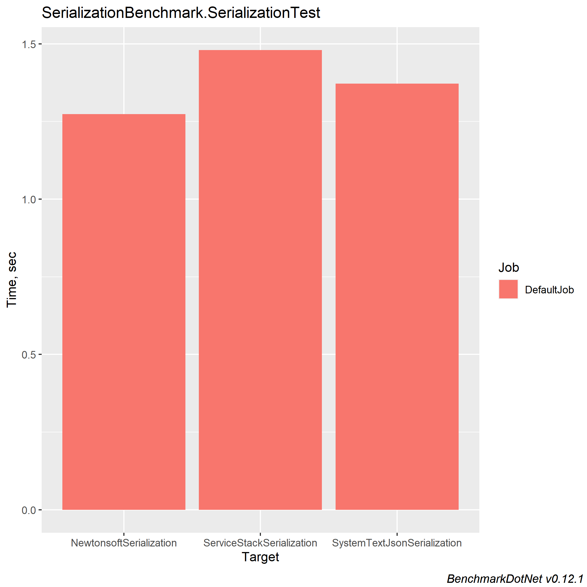

# JSONSerializationBenchmark

The JSON Serialization Benchmark is a console application with a purpose (as the name describes) to test the performance of the various JSON serializers that exists out there.

##### Console Application should be run in RELEASE mode.
##### If you do not have installed R comment out [this line](https://github.com/PKompis/.NETSerializationBenchmark/blob/main/SerializationBenchmark/Program.cs#L12)


## Libaries used

- [BenchmarkDotNet](https://github.com/dotnet/BenchmarkDotNet)
- [Bogus](https://github.com/bchavez/Bogus)

## Serializers Tested
- [Newtonsoft](https://www.newtonsoft.com/json)
- [ServiceStack](https://github.com/ServiceStack/ServiceStack.Text)
- [System.Text.Json](https://www.nuget.org/packages/System.Text.Json)
- [Jil](https://github.com/kevin-montrose/Jil)
- [Utf8Json](https://github.com/neuecc/Utf8Json)

## Dataset

A list of a custom object that can be found [here](https://github.com/PKompis/JSONSerializationBenchmark/blob/main/SerializationBenchmark/Types/MainTestObject.cs).
10.000 elements are added to the above described list.

## Results

``` ini
BenchmarkDotNet=v0.12.1, OS=Windows 10.0.19042
Intel Core i5-4670K CPU 3.40GHz (Haswell), 1 CPU, 4 logical and 4 physical cores
.NET Core SDK=3.1.403
  [Host]     : .NET Core 3.1.9 (CoreCLR 4.700.20.47201, CoreFX 4.700.20.47203), X64 RyuJIT
  DefaultJob : .NET Core 3.1.9 (CoreCLR 4.700.20.47201, CoreFX 4.700.20.47203), X64 RyuJIT

```
|                      Method |       Mean |    Error |   StdDev |
|---------------------------- |-----------:|---------:|---------:|
|     NewtonsoftSerialization | 1,456.0 ms |  8.45 ms |  7.06 ms |
|   ServiceStackSerialization | 1,716.7 ms |  4.30 ms |  3.81 ms |
| SystemTextJsonSerialization | 1,526.9 ms |  5.47 ms |  5.11 ms |
|       Utf8JsonSerialization |   830.8 ms |  4.65 ms |  4.13 ms |
|            JilSerialization |   686.3 ms | 11.43 ms | 10.69 ms |




## Source code directory layout:

<pre>
SerializationBenchmark/
├── Program.cs
├── Data/
|   ├── MockData.cs
├── Serialization/
│   ├── Base/
│   |   ├── ISerializationTest.cs
│   |   ├── SerializerTest.cs
│   ├── Implementation/
│   |   ├── JilSerializer.cs
│   |   ├── NewtonsoftSerializer.cs
│   |   ├── ServiceStackSerializer.cs
│   |   ├── SystemTextJsonSerializer.cs
│   |   ├── Utf8JsonSerializer.cs
├── Types/
│   ├── BaseTestObject.cs
│   ├── MainTestObject.cs
│   ├── TestEnum.cs
</pre>

## Authors

- Kompis Panagiotis


## License

This project is licensed under the MIT License see the [LICENSE.md](https://github.com/PKompis/.NETSerializationBenchmark/blob/main/LICENSE) file for details.